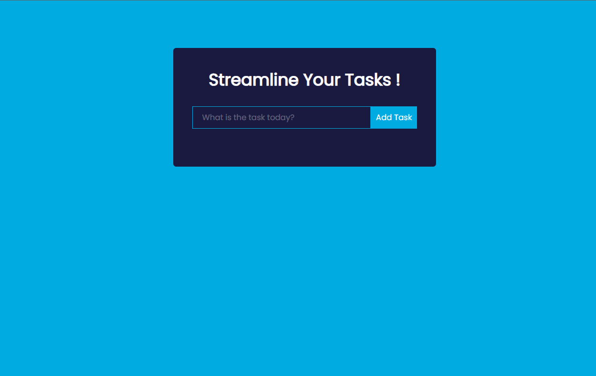
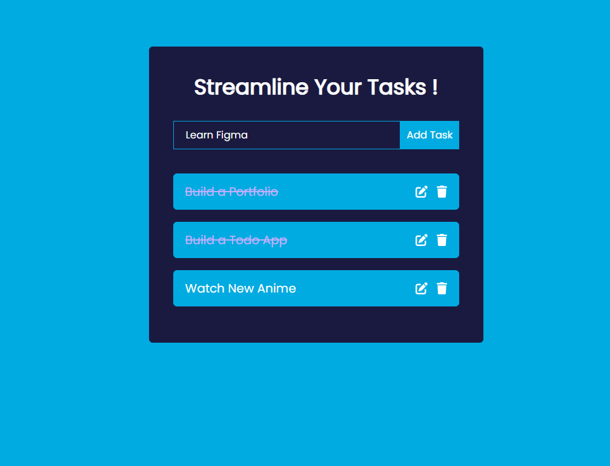

# Todo App

## Description

This simple todo App is built with ReactJS and functions with the useState hook. The task and task list are hooked and rerendered whenever the user updates.

## ScreenShot




## Technologies Used

The technologies used are HTML,CSS ,JavaScipt with ReactJS Library

## Installation

Open your terminal or Command Prompt and use these commands to install in your device

```
# Clone the repository
git clone https://github.com/your-username/your-repo-name.git

# Navigate to the project directory
cd your-repo-name

# Install dependencies
npm install

# Run the app
npm start

```

## Acknowledgements

This project is inspired by [https://github.com/MaheshRautrao/React-Todo-list]. A really simple and cool project made by this person.

## Contact

Feel free to reach out to me if you have any questions, feedback, or suggestions!

**Email:** [mohanraji2810@gmail.com](mailto:mohanraji2810@gmail.com)
